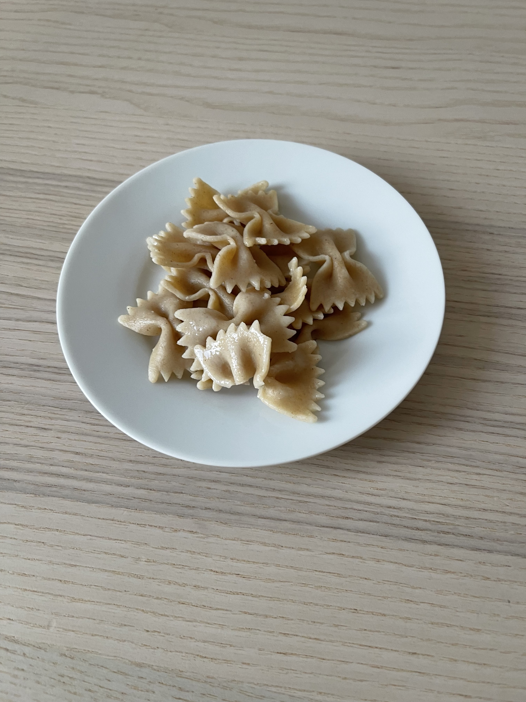

# Template

## Zutaten
* 100 gr Nudeln
* Salz
* opt. Pesto

## Zubereitung
Die Nudeln im Salzwasser kocher. Optional kann Pesto dazu gegessen werden.

## Eigenschaften
* **Ernährung**: Vegan
* **Kinderfreundlich**: Ja
* **Gesamtzeit**: 10
* **Zubereitungszeit**: 10